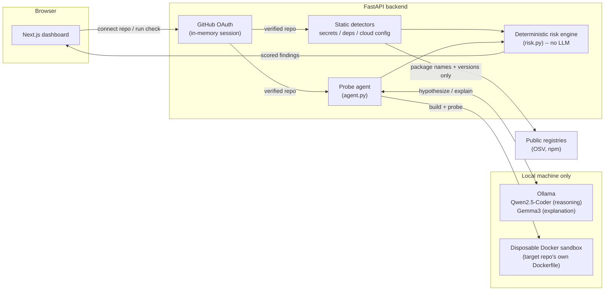

# Aegis — AI Pentesting Agent


**ASYNC 2026 — Cybersecurity & Defense Track · Team Barbie**

---

## 1. Context & Overview

### Elevator pitch

More people than ever are shipping real, live web apps solo — vibe coders and
indie developers going from idea to a deployed product in a weekend, powered
by AI pair-programmers. Almost none of them run a security review before
launch, not because they don't care, but because a real pentest needs a
specialist, costs real money, and takes days they don't have.

**Aegis is an autonomous AI pentesting agent** that gives that person an
honest, automated security check instead: it maps out a repo you own, forms
a hypothesis about what could be broken, safely confirms it against a
disposable sandboxed copy of the live app, explains the result in plain
language, and — where possible — generates a fix and re-tests it to prove
the fix actually holds. Reasoning and explanation run on free local models
via Ollama, so your source code never leaves your machine (dependency
version lookups do query public registries — see
[Scope and safety](#scope-and-safety)).

**Target audience:** solo developers, indie hackers, and small teams
shipping a real product who have no practical path to a professional
pentest before they go live — not a replacement for a professional
engagement (see [Architecture grounding](#architecture-grounding) for how
that shaped the design).

**Core features:**
- Static detection: leaked secrets, vulnerable/hallucinated dependencies, open cloud config
- Active probe: builds your app in an isolated Docker sandbox, sends real HTTP requests to confirm missing-auth and IDOR findings against the *running* app
- "Test a Hunch": type a free-text suspicion, get an honest confirmed / not found / not-testable verdict
- One deterministic security score, findings sorted worst-first, AI-generated + re-verified fixes

### Demo

- **Demo video script (4 min):** [`demo-video-script.md`](demo-video-script.md)
- **Live in-app demo mode** (no GitHub, no Docker, no Ollama required): run the frontend and open `/demo`
- Screenshots: see the dashboard, risk-by-area gradient bars, and the sandbox-opening flow described in the demo script above — add rendered screenshots/GIFs here before submission

---

## 2. Architecture & System Design

### System diagram



### End-to-end execution flow

```
1. User signs in with GitHub (OAuth) -> backend verifies push/admin access -> shallow-clones repo
2. User picks a scope (whole app / a subdirectory)
3. Static scan runs:       detect -> classify (risk.py, rule-based) -> explain (Gemma3)
4. Active probe runs:      trace routes -> Qwen2.5-Coder hypothesizes candidates
                            -> build target's Dockerfile in a disposable sandbox
                            -> send one fixed, safe request per candidate
                            -> classify (risk.py) -> explain (Gemma3)
5. Findings merge into one score + risk-by-area breakdown, streamed to the
   frontend as real progress events (never a simulated timer)
6. Per finding: "Fix" generates a diff and RE-RUNS the check against it
   before reporting "resolved"
```

Both the static scan and the active probe follow the same discipline:
nothing is reported as a finding until it's independently confirmed, and no
fix is reported "resolved" until a fresh re-check verifies it.

### Architecture grounding

Aegis's design leans on two existing references rather than guessing at
what an "AI pentest agent" should look like from scratch:

- **PentestGPT** (Deng et al., *USENIX Security 2024*) — their benchmark
  found that a single LLM run end-to-end loses track of the overall
  testing goal over a long session: it forgets earlier findings and
  overweights whatever it saw most recently. Their fix was splitting the
  agent into separate roles instead of one giant prompt. Aegis applies
  that same principle to its own three-way split: `risk.py`'s fixed rules
  decide severity and score, **Qwen2.5-Coder** only proposes what to
  check, and **Gemma3** only explains a finding *after* its severity is
  already decided — it can never raise or lower anything. Aegis also
  reuses PentestGPT-legacy's multi-provider LLM connector directly as a
  library (see [Installation, step 4](#step-by-step-installation)).
- **AIDA**'s agent loop — "reason about the target, pick a tool, run it,
  record why" — is the shape behind `app/probes/agent.py`'s orchestrator:
  trace the target once, let each registered `Tool` reason independently,
  then confirm every tool's candidates inside one shared sandbox. Aegis
  scopes this down hard versus a general agent loop: the tools are a
  small, fixed set Aegis ships with (`app/probes/tool.py`), never an
  open-ended command executor, and every tool's probe is a single safe,
  read-only, no-credential request against a repo the caller already
  proved they own.

### Documentation links

- API surface: see [API endpoints](#api-endpoints) below (no separate
  OpenAPI/Swagger doc yet — FastAPI serves one automatically at
  `http://localhost:8000/docs` once the backend is running)
- Module-level docs: every backend module under `backend/app/` opens with a
  docstring explaining its role in the pipeline — start at `main.py`,
  `probes/agent.py`, and `risk.py`

---

## 3. Installation & Configuration

### Prerequisites & tech stack

| Component | Requirement |
|---|---|
| Python | >= 3.11 |
| Node.js | >= 20.x |
| Docker Desktop | Required for the active probe (Phases 4-6) only; static detection works without it |
| GPU | None required — local models run on CPU via Ollama (a GPU speeds up inference but isn't required) |
| Backend stack | FastAPI, Uvicorn, `docker` SDK, Playwright (Chromium) |
| Frontend stack | Next.js 16, React 19, Tailwind v4, TypeScript |
| Local LLM runtime | [Ollama](https://ollama.com), models: `qwen2.5-coder:7b`, `gemma3:4b` |
| Secrets scanner | [Gitleaks](https://github.com/gitleaks/gitleaks) |

### Step-by-step installation

**1. Docker Desktop** — install and make sure it's running. Required for
the active probe (Phases 4-6); static detection (Phases 1-3) works
without it.

**2. Local LLMs (Ollama)**

```bash
ollama pull qwen2.5-coder:7b
ollama pull gemma3:4b
```

**3. Secrets scanner (Gitleaks)**

```bash
winget install gitleaks
# or download from https://github.com/gitleaks/gitleaks/releases
```

**4. Reference library (PentestGPT-legacy)**

Aegis reuses PentestGPT-legacy's multi-provider LLM connector as a library
(not its CLI). Clone it as a sibling folder — it's excluded from this
repo's git history (see `.gitignore`) as an external MIT-licensed
dependency, not our code:

```bash
git clone https://github.com/GreyDGL/PentestGPT.git
```

**5. GitHub OAuth App** (for "Connect with GitHub")

1. GitHub -> Settings -> Developer settings -> OAuth Apps -> New OAuth App
2. Application name: `Aegis (Dev)`
3. Homepage URL: `http://localhost:3000`
4. Authorization callback URL: `http://localhost:8000/github/oauth/callback`
5. Create it, generate a Client Secret, copy `backend/.env.example` to
   `backend/.env` and fill both in (the real `.env` is git-ignored — never
   commit it; see the [Environment Variables Matrix](#environment-variables-matrix) below)

**6. Backend**

```bash
cd backend
pip install -r requirements.txt
uvicorn app.main:app --reload --port 8000
```

Run this from *inside* `backend/` — `app.main:app` resolves relative to
your current directory.

**7. Frontend**

```bash
cd frontend
npm install
npm run dev
```

Opens at `http://localhost:3000`. CORS and the OAuth redirect are already
configured for this port.

**8. Try it without the frontend**

```bash
# Static detection
curl -X POST http://localhost:8000/scan \
  -H "Content-Type: application/json" \
  -d '{"repo_path": "../demo-app"}'

# Active probe (needs Docker running)
curl -X POST http://localhost:8000/probe \
  -H "Content-Type: application/json" \
  -d '{"repo_path": "../demo-app"}'
```

### Environment Variables Matrix

All variables live in `backend/.env` (copy from `backend/.env.example`,
which is committed; the real `.env` is git-ignored).

| Key | Description | Type | Default | Required |
|---|---|---|---|---|
| `GITHUB_CLIENT_ID` | GitHub OAuth App client ID | string | — | Yes, for "Connect with GitHub" |
| `GITHUB_CLIENT_SECRET` | GitHub OAuth App client secret | string | — | Yes, for "Connect with GitHub" |
| `GITHUB_OAUTH_REDIRECT_URI` | OAuth callback URL | URL string | `http://localhost:8000/github/oauth/callback` | No |
| `AEGIS_FRONTEND_URL` | Where the backend redirects after OAuth | URL string | `http://localhost:3000` | No |
| `AEGIS_REASONING_MODEL` | Model used for route/vuln hypothesis | `provider:model` string | `ollama:qwen2.5-coder:7b` | No |
| `AEGIS_EXPLAIN_MODEL` | Model used for plain-language explanation | `provider:model` string | `ollama:gemma3:4b` | No |

Without `GITHUB_CLIENT_ID`/`GITHUB_CLIENT_SECRET` set, "Connect with
GitHub" is disabled but static detection and the active probe still work
against a local `repo_path` directly (see step 8 above).

---

## 4. Developer Experience & Quality Control

### Usage snippets

```bash
# Static scan, streamed progress (NDJSON)
curl -N -X POST http://localhost:8000/scan/stream \
  -H "Content-Type: application/json" \
  -d '{"repo_path": "../demo-app"}'

# Active probe, streamed progress
curl -N -X POST http://localhost:8000/probe/stream \
  -H "Content-Type: application/json" \
  -d '{"repo_path": "../demo-app"}'

# Generate + re-verify a fix for one finding
curl -X POST http://localhost:8000/fix \
  -H "Content-Type: application/json" \
  -d '{"repo_path": "../demo-app", "finding": {...}}'
```

### Testing & QA commands

This is a hackathon-stage build: there is **no automated test suite or CI
pipeline yet** — verification has so far been manual, end-to-end runs
against the two bundled vulnerable fixtures (`demo-app/`, `demo-app-py/`)
plus a clean control target, comparing expected vs. actual findings each
time. That's a known gap, tracked in
[Troubleshooting & known limitations](#troubleshooting--known-limitations).

What *is* available today:

```bash
# Frontend: TypeScript type-check (no separate lint config committed yet)
cd frontend
npx tsc --noEmit

# Backend: import/syntax sanity check
cd backend
python -c "from app.main import app; print([r.path for r in app.routes])"
```

---

## 5. Reliability, Performance & Security

### Benchmarks & maturity status

**Maturity: Alpha / hackathon build.** Not production-hardened; built and
demoed within a 24-hour hackathon window.

| Stage | Typical duration | Notes |
|---|---|---|
| Static scan | A few seconds | Regex/AST-level, no network round-trip except registry lookups |
| Active probe (Docker build + probe) | Up to ~1–2 min | Dominated by the Docker image build; varies with the target repo's own Dockerfile |
| Full pipeline, first run on a machine | ~6 min | Includes cold Ollama model load; subsequent runs are faster once models are warm |

Switching **Qwen2.5-Coder** for both reasoning and explanation (instead of
splitting the job with **Gemma3**) was measured at ~6x slower per
explanation call — this is why the two-model split exists, not just for
separation of concerns but for real latency.

### Troubleshooting & known limitations

| Symptom | Cause | Workaround |
|---|---|---|
| `ModuleNotFoundError: No module named 'app'` on `uvicorn` startup | Command run from the repo root instead of `backend/` | `cd backend` first, then `uvicorn app.main:app --reload --port 8000` |
| `{"detail":"Invalid or expired OAuth state..."}` | Revisited a GitHub callback URL from browser history (single-use `state`/`code`), or the backend restarted mid-flow (in-memory state is wiped on restart) | Start a fresh tab, click "Connect with GitHub" again as a new action — never reload the callback URL |
| Active probe reports "skipped" | No Docker running, no Dockerfile in the target repo, or no supported entry point (Express/FastAPI/Flask) detected | Start Docker Desktop; add a `Dockerfile`; confirm the app's entry file matches a supported convention |
| Port already bound / new code not picked up after edits | A stale `uvicorn --reload` process from an earlier run still holds the port | Find and kill every process holding that port (`netstat -ano \| findstr :8000` on Windows), then restart from `backend/` |
| Explanation text reads "(explanation unavailable: ...)" | Local model unreachable (Ollama not running, or model not pulled) | `ollama pull qwen2.5-coder:7b gemma3:4b`, confirm Ollama is running |

**Known limitations (honest scope, not hidden):**
- Active-probe coverage is narrow by design: missing-auth and IDOR only,
  not a general vulnerability scanner (see
  [Scope and safety](#scope-and-safety))
- No attack chaining — each finding is checked independently
- Route tracing is regex/heuristic-based, not a full AST for every
  supported framework
- No automated test suite or CI yet (see [Testing & QA commands](#testing--qa-commands))

### Security reporting

This is a hackathon project with no dedicated security contact yet. If you
find a vulnerability **in Aegis itself** (not a finding Aegis surfaced
about *your* target repo — that's the product working as intended), please
open a private GitHub Security Advisory on this repository rather than a
public issue.

---

## 6. Governance & License

### Open source & licensing

- **License:** MIT (see [`LICENSE`](LICENSE))
- **Contributions:** this was built as a hackathon submission by Team
  Barbie for ASYNC 2026; issues and PRs are welcome after the event, but
  there's no formal contribution process yet
- **Code style:** no linter config is committed yet (see
  [Testing & QA commands](#testing--qa-commands)); follow the existing
  style in the file you're editing — short, explicit functions, docstrings
  on every module explaining its role in the OBSERVE → DETECT → EXPLAIN →
  RESPOND pipeline
- **Third-party code:** PentestGPT-legacy's LLM connector is used as an
  external library, cloned as a sibling folder and excluded from this
  repo's git history — see [Installation, step 4](#step-by-step-installation)
  and its own MIT license at
  [github.com/GreyDGL/PentestGPT](https://github.com/GreyDGL/PentestGPT)

---

## Pipeline

```
OBSERVE  ->  DETECT  ->  EXPLAIN  ->  RESPOND
```

## Status

### Phases 1-3: static detection — complete
- [x] Secrets (Gitleaks), git-ignore aware, searches the whole repo
- [x] Dependencies: known vulns (OSV API) + hallucinated/non-existent
      packages (npm registry), every `package.json` in the repo
- [x] Cloud config: Firebase/Firestore open rules, **and** Supabase Row
      Level Security (disabled, open policies, never-enabled tables)
- [x] Fix + re-verification loop for every finding type above

### Phases 4-6: the active probe — complete
- [x] **Agent + tool registry** (`app/probes/agent.py`, `tool.py`): traces
      the target once, lets each registered `Tool` reason independently,
      then confirms every tool's candidates inside one shared, disposable
      Docker sandbox — the same "reason, pick, run, record" shape AIDA's
      agent loop uses (see [Architecture grounding](#architecture-grounding)),
      scoped down hard: a small fixed tool set, never an open-ended
      command executor
- [x] **Missing-auth tool**: traces routes for ones that look sensitive but
      have no auth attached, confirms with one unauthenticated request
- [x] **IDOR tool**: traces id-scoped routes for a missing ownership check
      *in the actual handler code*, confirms by requesting the same route
      with two different ids under one fixed test identity
- [x] **Framework-aware**: Express (JS), FastAPI and Flask (Python) —
      auto-detected from the repo's own code, not assumed
- [x] Fix + re-verification for both active-probe finding types (reuses
      whatever auth/ownership pattern the app already uses elsewhere,
      never invents one)

### Everything around it — complete
- [x] Two local models, split by job: **Qwen2.5-Coder** for code reasoning
      (route tracing, vulnerability hypothesis), **Gemma 3** for
      plain-language explanations — verified ~6x faster per call than
      using Qwen for both
- [x] Deterministic risk scoring (`app/risk.py`): score, area, likelihood,
      impact, and the risk-matrix placement all come from fixed rules,
      **never** the LLM — the model only explains a finding after its
      severity is already decided
- [x] Real-time NDJSON progress streaming (`/scan/stream`, `/probe/stream`)
      — the frontend's progress overlay follows genuine backend stages,
      never a simulated timer
- [x] GitHub OAuth ("Connect with GitHub") + repo picker — no token is
      ever typed into Aegis's UI or sent to the frontend
- [x] Full dashboard (Next.js + Tailwind): animated score gauge, verdict,
      risk-by-area bars, risk matrix, evidence donut, per-finding Fix
      button with live diff, PDF export
- [x] "Test a Hunch": a free-text, user-guided pass biased toward a
      suspicion, with an honest confirmed/not-found/not-testable verdict

## API endpoints

| Endpoint | What it does |
|---|---|
| `POST /scan` / `/scan/stream` | Phases 1-3: secrets, dependencies, cloud config. Streaming variant emits real progress. |
| `POST /probe` / `/probe/stream` | Phases 4-6: the active probe (missing-auth, IDOR). Skips honestly if Docker/a Dockerfile/a supported entry point isn't available. |
| `POST /fix` | Generate + re-verify a fix for one finding (never touches the working tree until applied). |
| `POST /hunch` | "Test a Hunch": judges a free-text suspicion against findings already gathered this session. |
| `GET /github/oauth/login`, `GET /github/oauth/callback` | The OAuth flow — redirects to GitHub, then back with a session cookie. |
| `GET /github/session`, `GET /github/repos`, `POST /github/logout` | Session status, the connected account's repos, disconnect. |
| `POST /github/verify-and-clone` | Verifies push/admin access, then shallow-clones the repo. |
| `POST /probe/cancel` | Best-effort cancel of a running probe ("Terminate pentest"). |

## Project structure

```
backend/
  app/
    detectors/       secrets, dependencies, cloud_config, supabase, routes
    probes/          agent.py (orchestrator), tool.py (interface),
                      missing_auth.py, idor.py -- the active-probe tools
    fixers.py         fix + re-verify, one function per finding type
    risk.py           deterministic scoring/area/matrix -- no LLM involved
    llm.py            local model connector (Qwen for reasoning, Gemma for explain)
    sandbox.py        builds/runs/tears down the target's own Dockerfile
    hunch.py           "Test a Hunch" evaluation
    github_oauth.py, github_auth.py   OAuth flow, permission check, clone
    main.py           FastAPI app, all endpoints
frontend/
  app/                Next.js dashboard (risk-dashboard, sandbox-badge,
                       analysis-overlay, GitHub connect + repo picker)
  components/ui/       shared UI primitives (loader, onboard-card)
demo-app/             Deliberately vulnerable Express + Firebase + Supabase target
demo-app-py/          Deliberately vulnerable FastAPI target
PentestGPT/           External reference clone (not committed -- see .gitignore)
```

## Scope and safety

Aegis only ever scans/probes repos the user has verified ownership of (via
GitHub OAuth, or a local path they provide directly) — there is no
scanning of arbitrary or third-party targets.

- **Static detection** is fully deterministic: regex/AST-level parsing,
  known-vulnerability database lookups. No LLM involvement in the
  detection itself.
- **The active probe** builds the target's own Dockerfile into a
  disposable, resource-limited container Aegis fully controls, then runs
  exactly one fixed, safe, non-destructive request per hypothesis (no
  exploit payloads, no data exfiltration, no writes). The "tools" the
  agent can run are a small, fixed set (`app/probes/tool.py`) — there is
  no path for the model to invent or request a new one.
- **Scoring is rule-based, not LLM-based.** `app/risk.py`'s score, area,
  likelihood, and impact all come from fixed lookup tables, computed
  *before* the local model ever sees a finding — it can only explain,
  never raise or lower anything.
- **Dependency lookups** (OSV, npm registry) send only public package
  names and versions — the same identifiers `npm audit`/`pip-audit` use.
  Your source code itself never leaves the machine; only the local LLM
  ever reads it.
- **GitHub credentials** are never typed into Aegis's UI. OAuth tokens
  live only in an in-memory, httpOnly-cookie-keyed backend session —
  never sent to the frontend, logged, or written to disk.
